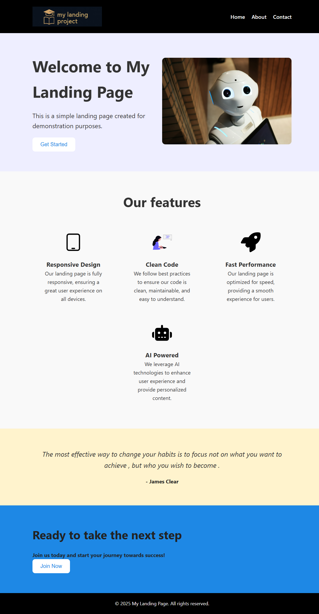

# 🧑‍💻 odin-landing-page

This is a project from the Foundations section of The Odin Project.  
The goal is to recreate a landing page using **HTML** and **CSS**, focusing especially on **Flexbox layout**.

---

## ✅ Skills Demonstrated

- ✅ Semantic HTML structure
- ✅ CSS styling and layout
- ✅ Flexbox for responsive design
- ✅ Git version control and GitHub collaboration
- ✅ Visual layout analysis from a design mockup

---

## 🖥️ Live Preview

🔗 **Live Site**: [https://whyy-me.github.io/odin-landing-page](https://whyy-me.github.io/odin-landing-page)

---

## 🗂️ Project Structure

odin-landing-page/
├── index.html
├── styles.css
├── images/
│ └── my-logo.jpg
├── README.md
└── screenshot.png

---

## 📸 Final Output



---

## 📌 What I Learned

- Structuring a page with semantic tags like `<header>`, `<main>`, `<section>`, and `<footer>`
- Mastering Flexbox properties like `justify-content`, `align-items`, and `flex-direction`
- Creating reusable CSS classes for consistent styling
- Analyzing visual mockups and converting them into code
- Using Git to track progress and GitHub to host and share the project

---

## ⚙️ How to Run Locally

1. Clone the repository:

   ```bash
   git clone https://github.com/whyy-me/odin-landing-page.git
   cd odin-landing-page

2. Open `index.html` in your browser.
